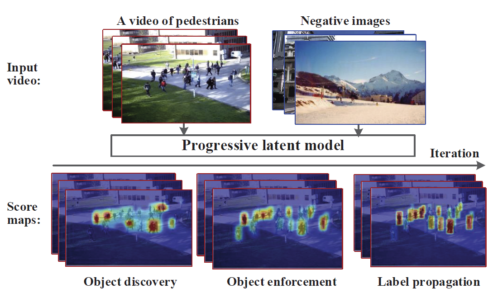

# Self-learning Scene-specific Pedestrian Detectors using a Progressive Latent Model

### Introduction
A self-learning approach is proposed towards solving scene-specific pedestrian detection problem without any human¡¯ annotation involved. The selflearning approach is deployed as progressive steps of object discovery, object enforcement, and label propagation. 

This is a matlab code of [Self-learning Scene-specific Pedestrian Detectors using a Progressive Latent Model](https://arxiv.org/abs/1611.07544). Copyright Reserved by University of Chinese Academy of Sciences.
It is free for academy purpose.
Please contacet qxye@ucas.ac.cn if you have more problems

Runtime enviroment: Matalb12 or later vergion, 

### Configuration:

1. Download the Edgebox proposal generation code from http://vision.ucsd.edu/~pdollar/research.html

2. Download the DPM code from Ross Grishick's UC berkely websit

3. Supose the video name is 'PETS09-S2L2.avi', put the video in the dataset 'data\'

4. Make a folder as the name of video

5. Randomly prepare >1000 negtive images in the data\videoname\neg folder
   Prepare the neg_filelist.txt in the data\videoname foler

6. Run Demo by inputting st_learning('.\data\PETS09-S2L2.avi')